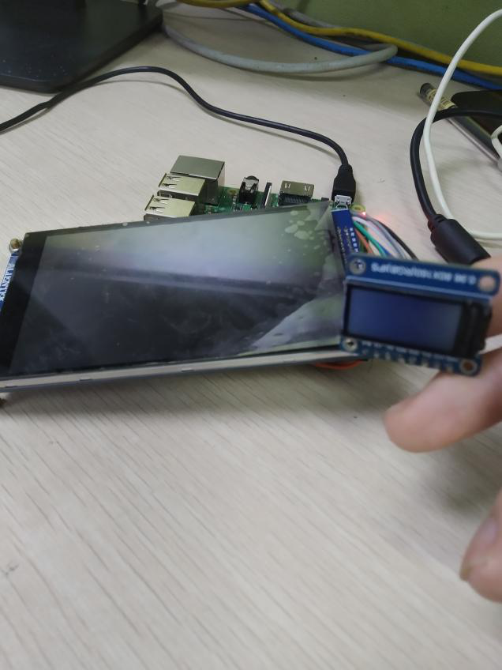
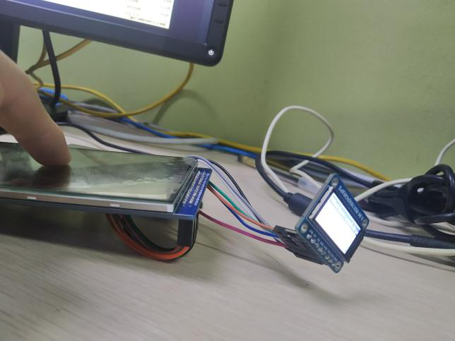
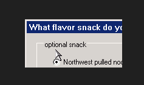

# 结项报告

## 项目信息

- 项目名称：将 MiniGUI 5.0 运行到 RT-Thread 或者 FreeRTOS 开发板上。
- 方案描述：将 MiniGUI 5.0 (Standalone）移植到运行FreeRTOS 的开发板上。开发完成针对具体开发板的图形引擎、输入引擎等。
- 时间规划：
	- 中期报告（8 月 10 日 - 8 月 15 日）
	- 完成移植并做演示（8 月 16 日 - 9 月 30 日）
	- 项目评审阶段（10 月 1 日 - 10 月 30 日）

## 项目总结

### 项目成果：
  将 MiniGUI 5.0 (Standalone模式）成功地移植到了运行FreeRTOS的开发板上；开发板芯片为BCM2837B0，ARM Cortex-A53 CPU；于x86_64 ubuntu 20.04 LTS主机上，使用交叉编译器arm-linux-gnueabihf-gcc，完成程序的编译；图形引擎用到了一块160×80像素的ips tft显示屏（驱动芯片为ST7735S）；输入引擎用到了一块电容型触摸屏（驱动芯片为GT9141）；下面具体介绍如何去构建程序：
#### 安装交叉编译器
```
sudo apt install gcc-arm-linux-gnueabihf
```
#### 编译&安装writingPi
```
cd summer2020/MyWiringPi
arm-linux-gnueabihf-gcc -c -Wall *.c
arm-linux-gnueabihf-ar  rcs libmygpio.a  *.o
sudo cp *.h  /usr/local/include
sudo cp libmygpio.a  /usr/local/lib
cd ../..
```
#### 编译&安装FreeRTOS
```
cd summer2020/FreeRTOS
cd c
arm-linux-gnueabihf-gcc   -I ../h   -Wall   -c *.c
arm-linux-gnueabihf-ar  rcs libfreertos.a  *.o
sudo cp libfreertos.a  /usr/local/lib
cd h
sudo cp *.h  /usr/local/include
cd ../..
```
#### 编译&安装minigui5.0
```
./autogen.sh
```
```
CC=arm-linux-gnueabihf-gcc \
AR=arm-linux-gnueabihf-ar \
./configure \
--host=x86_64-pc-linux-gnu \
--build=armv7l-unknown-linux-gnueabihf \
--target=armv7l-unknown-linux-gnueabihf \
--disable-shared                           \
--enable-static                            \
--with-osname=freertos                        \
--with-targetname=external                 \
--with-runmode=sa                          \
--disable-videodummy                       \
--disable-videopcxvfb                      \
--disable-videoqvfb                        \
--disable-videodrm                         \
--disable-videofbcon                       \
--enable-videocommlcd                      \
--disable-dummyial                         \
--disable-consoleial                       \
--disable-libinputial                      \
--enable-commial                           \
--disable-consoleimps2                     \
--disable-mousecalibrate                   \
--enable-incoreres                         \
--enable-cursor                            \
--disable-clipboard                        \
--disable-adv2dapi                         \
--disable-aboutdlg                         \
--enable-savebitmap                       \
--disable-savescreen                       \
--disable-dblclk                           \
--disable-splash                           \
--disable-latin9support                    \
--disable-gbsupport                        \
--disable-gbksupport                       \
--disable-fullunicode                      \
--disable-rbfsupport                       \
--disable-vbfsupport                       \
--disable-upfsupport                       \
--disable-qpfsupport                       \
--disable-ttfsupport                       \
--disable-complexscripts                   \
--disable-rbfvgaoem                        \
--disable-rbfterminal                      \
--disable-rbffixedsys                      \
--disable-fontsserif                       \
--disable-fontcourier                      \
--disable-fontsystem                       \
--disable-fonttimes                        \
--disable-ttfcache                         \
--with-ttfcachenum=16                      \
--with-ttfcachesize=64                     \
--disable-bmpfsupport                      \
--disable-jpgsupport                       \
--disable-pngsupport                       \
--disable-gifsupport                       \
--disable-flatlf                           \
--disable-skinlf                           \
--disable-ctrlsledit                       \
--disable-ctrlnewtextedit                  \
--disable-ctrllistbox                      \
--disable-ctrlpgbar                        \
--disable-ctrlcombobox                     \
--disable-ctrlpropsheet                    \
--disable-ctrlnewtoolbar                   \
--disable-ctrlmenubtn                      \
--disable-ctrlspinbox                      \
--disable-ctrllistview                     \
--disable-ctrlanimation                    \
--disable-updateregion                     \
--disable-textmode                         \
--disable-shmopen
```
```
make  -j`getconf _NPROCESSORS_ONLN`;sudo make  install
```
#### 编译mg-tests&查看演示效果
```
cd summer2020/mg-tests
./autogen.sh
```
```
CC=arm-linux-gnueabihf-gcc \
AR=arm-linux-gnueabihf-ar \
./configure \
--host=x86_64-pc-linux-gnu \
--build=armv7l-unknown-linux-gnueabihf \
--target=armv7l-unknown-linux-gnueabihf \
--disable-shared                           \
--enable-static
```
```
make -j`getconf _NPROCESSORS_ONLN`;cd comm-engines;./comm-engines
```




### 遇到的问题及解决方案：
- 首先非常感谢项目导师魏老师的指导。开展比赛后，魏老师第一时间组建了答疑群，帮助学生理清思路，给出路线，及时解答项目过程中的问题。可以说，正是有了魏老师正确的引领，我才能如期完成项目。
- 一开始我对automake工具不是很熟悉，在魏老师的指导下，我参阅了minigui的文档，较为快速地理解了minigui的编译配置选项、运行配置选项地意义，掌握了如何用automake工具于交叉编译器构建minigui。
- 其次是在利用make构建minigui（os=freertos）时，出现了一些bug。魏老师地指导让我快速锁定了问题并能够完善了minigui原有代码。
- 最后就是移植到开发板上的过程中遇到的问题。移植到开发板上，不仅要跟硬件打交道，还要跟硬件打交道。我在编写驱动的时候，遇到了不少问题，比如屏幕亮着两者灭了，触摸屏始终读不到数据。这些问题归根到底其实是引脚时序上出现了问题。通过仔细排查，不断测试驱动程序，我终于完善了驱动程序。
